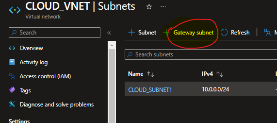
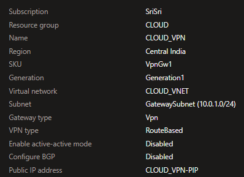

# deploying VPN to OnPrem setup using Win2019 server

    1.we have to deploy 2 VirtualNetworks with different address spaces to avoid conflict

    2.deploy with a setup for CLOUD resources with `MultiAZ-VMCreationWithAssignedParameters.ps1`
        
        - $RG = "CLOUD"
        - $ADDRESS_SPACE = "10.0.0.0/16"
        - $SUBNET = "10.0.0.0/24"
        - no chnages in remaining template
    
    3.deploy OnPrem setup with same script by doing below chnages `MultiAZ-VMCreationWithAssignedParameters.ps1`

        - $RG = "OnPrem"
        - $ADDRESS_SPACE = "192.168.0.0/16"
        - $SUBNET = "192.168.0.0/24"
        - No chnages in remaining template
    
    4.deploy a GatewaySubnet in CLOUD_VNET

        
        
    5.start deploying "Virtual Network Gateway" using Gatewaysubnet,it may take 20 to 30min for provisioning

        

    
    6.while VPN provisioning,we will provision "Local Network Gateway"(here we are going to define the path for OnPremise)
        
        

    
    8.site-to-site configuration

        - "Add Connection" in VPN
        - 

    7.Now setup OnPrem VM for VPN setup

        - Add Roles and features
        - check "Remote Access" under "Server Roles"
        - check "Direct access and VPN(RAS)" under Remote Access"
        - in Win2019 Server > Tools > Routing And Remote Access > On Hostname( in my case OnPremVM1) > right click and enable Routing and Remote Access > then choose Custom and apply
        - Now Tree will be enabled for OnPremVM1
            - for Network interfaces Add "new Demand-Dial interface wizard"
            - Connect Using Virtual Private Network(VPN)
            - select VPN Type as IKEv2
            - Destination Address should be "VPN-PIP"(already created this one while provisioning VPN)
            - Static Route for Remote Networks > we have to mention address space of CLOUD Netowrk i.e 10.0.0.0/24
            - ignore Dial-out credentials,because we wanted to use PSK
            - new Demand-Dial interface will be created
        - now we have to pass PSK through the Properties of demand-dial connection
            - click on Properties
            - in Options > change "Connection Type" to "Persistent Connection"
            - in Security > here we have to pass PSK
            - save it
        - on Demand-Dial interface click on Connect
        
        

