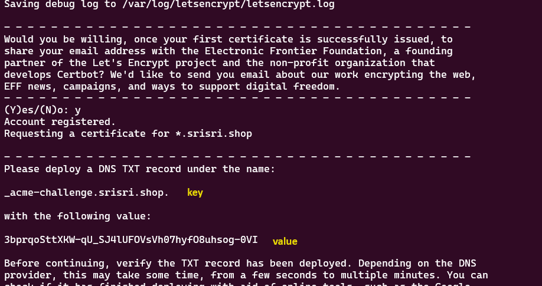

#`FOR CRT CERTIFICATES USING POWERSHELL`

#for application gateway

#for applicationGatewat integration,it only supports which is in .pfx format certificate only

#for that we have to combile certificate.crt and ca_bundle.crt to fullchain.crt

#by using below command we can able to create .pfx,here fullchain.crt & private.key files are required

`openssl pkcs12 -export -out certificatep12.pfx -inkey private.key -in fullchain.crt`

#`CREATING SSL CERT USING LET'S ENCRYPT(SHELL)`

#to install let's Encrypt package

#`sudo apt update && sudo apt install letsencrypt -y`

#to create a ssl cert

#`sudo certbot certonly --manual --preferred-challenges=dns --email <EMAIL-ID> --server https://acme-v02.api.letsencrypt.org/directory --agree-tos -d *.<DOMAIN-NAME>`

#output:

#we have to create a TXT dns record in domain for validation

# then only we have to press <ENTER> Key

#cert will be created in PEM format,for windows servers we have to modify them into PFX,for that

#`openssl pkcs12 -export -in /etc/letsencrypt/live/<domain>/fullchain.pem -inkey /etc/letsencrypt/live/<domain>/privkey.pem -out cert.pfx`

#`adding cert to windows server`

1.before proceeding we have to enable Web-Server including IIS Management tools
2.IIS Manager > Choose 'Server' > Server certificates > create CSR > import certificatep12.pfx
3.under 'Server' > select 'site' > Bindings > add 'https'(not need to enter anything,as we are creating for default site) > Save
4.under 'Server' > select 'site' > SSL Settings > Check 'require SSL' save
5.restart IIS
